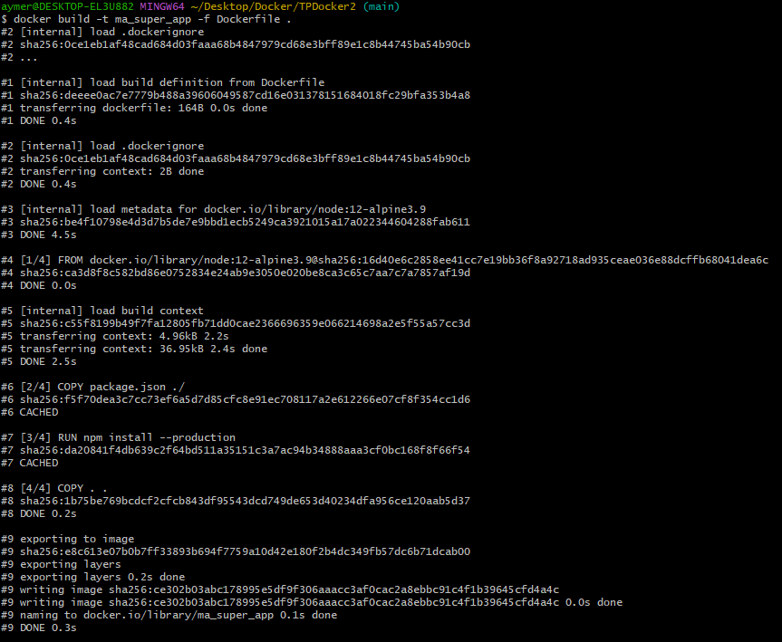
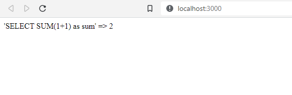

TP Conteneurs Docker 2
====================

2a\. Pour installer seulement les composant nécessaire il faut utiliser la commande suivante dans le dockerfile :
`RUN npm install --production` Cela permet de ne pas avoir de composant inutile dans le conteneur node.
----------------------------------------------------
3\. On rentre cette commande là où se trouve le fichier Dockerfile :
`docker build -t ma_super_app -f Dockerfile .`
----------------------------------------------------

4\. Après avoir rajouter le service app issue de l'image ma_super_app dans le docker-compose en renseignant les bonnes variables d'environement et buildé l'image avec la commande precédente, On rentre la commande `docker-compose up`.
L'application est ensuite accessible sur http://localhost:3000
----------------------------------------------------

